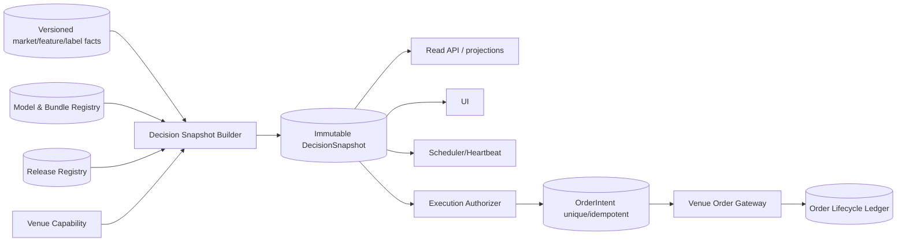

# BDD-led Domain Refactor Plan

> 日期：2026-08-11
> 狀態：**PROPOSED — Q1–Q7 + R1 ACCEPTED；Q8–Q10 WAITING FOR OWNER DECISIONS**
> 基線：`9e973bba`
> 原則：先characterization、再strangler；不以降低hard safety gate換取「變綠」。

## Goal

把Poly-Trader從「多artifact、多projection、AI敘事驅動的gate網」重構成：

- 清楚bounded contexts；
- immutable strategy/release/bundle/decision identities；
- 單一DecisionSnapshot；
- typed gate results與唯一owner；
- ExecutionAuthorizer作唯一真實送單邊界；
- heartbeat只排程/觀測，不重算domain policy；
- API/UI/docs只投影，不授權。

## Non-goals

- 不在本計畫中降低kill switch、permit、canary cap、venue lifecycle、idempotency、exposure limits。
- 不用改threshold來強迫高頻交易。
- 不把owner release等同live execution。
- 不在BDD核准前改交易核心。
- 不處理US-Stock-Trader；維持documentation-only。

## Target architecture（待BDD確認）

## Phase 0 — Characterization baseline

### Task 0.1: Approve as-is BDD

Files:
- `docs/specification/features/as-is/*.feature`
- `docs/specification/open-questions.md`

Actions:
1. Owner逐題確認Q1–Q10；Q1–Q7與補充風險決策R1已於2026-08-11接受。
2. 對每題建立ADR。
3. 建立`features/to-be/`，不得修改as-is來冒充現況。

Accepted output:
- `docs/adr/ADR-0001-live-canary-product-scope.md`
- `docs/specification/features/to-be/live-canary-product-scope.feature`
- `docs/adr/ADR-0002-personal-release-lifecycle.md`
- `docs/specification/features/to-be/personal-release-lifecycle.feature`
- `docs/adr/ADR-0003-exact-support-advisory.md`
- `docs/specification/features/to-be/exact-support-advisory.feature`
- `docs/adr/ADR-0004-decision-snapshot-truth.md`
- `docs/specification/features/to-be/decision-snapshot-truth.feature`
- `docs/adr/ADR-0005-autonomous-model-improvement.md`
- `docs/specification/features/to-be/autonomous-model-improvement.feature`
- `docs/adr/ADR-0006-immutable-deployment-bundle.md`
- `docs/specification/features/to-be/immutable-deployment-bundle.feature`
- `docs/adr/ADR-0007-exact-bundle-shadow-evidence.md`
- `docs/specification/features/to-be/exact-bundle-shadow-evidence.feature`
- `docs/adr/ADR-0008-conservative-live-canary-risk.md`
- `docs/specification/features/to-be/conservative-live-canary-risk.feature`

Verification:
- 每個core journey至少一個happy path、一個fail-closed path、一個stale/inconsistent path。
- 每個gate對應source code與現有test或標為known gap。

### Task 0.2: Freeze dirty WIP disposition

Actions:
1. 將原worktree dirty files分為code/docs/runtime artifacts。
2. code WIP逐commit或stash；runtime artifacts不與domain refactor混commit。
3. 只從可重現commit開始重構。

Verification:
- `git status --short`可解釋；沒有未歸屬的tracked WIP。

## Phase 1 — Introduce typed domain contracts without behavior change

### Task 1.1: Add gate vocabulary

Proposed files:
- `domain/gates.py`
- `domain/identity.py`
- `domain/snapshots.py`
- `tests/domain/test_gate_result.py`

Types:
- `GateCategory = EVIDENCE | RELEASE | DEPLOYMENT | MARKET | EXECUTION | CAPABILITY`
- `GateStatus = PASS | WARN | BLOCK | UNKNOWN | INCONSISTENT`
- `GateResult`含owner/enforced_at/provenance/release_condition。

Test:
- unknown/inconsistent execution gate必須blocking；advisory warning不可改寫release record。

### Task 1.2: Characterization adapters

Proposed files:
- `adapters/legacy_predictor_projection.py`
- `adapters/legacy_artifact_reader.py`

Actions:
- 將現有dict payload轉成typed DTO，不改計算。
- 對遺失欄位回`UNKNOWN`，不以`or`鏈靜默補值。

Verification:
- current API golden payload semantic parity；明確記錄fallback差異。

## Phase 2 — Version data and strategy identity

### Task 2.0: Eliminate historical 4H look-ahead before model promotion

Current defect:
- `backfill_missing_feature_rows()` fetches the latest 4H OHLCV once and reuses it for historical gaps。
- 4H extraction selects the final indicator value, so row `T` can receive information after `T`。

Proposed changes:
- introduce an `AsOfFeatureBuilder(cutoff=T)`；
- source 1m/4H candles from a versioned snapshot bounded by `T`；
- quarantine or rebuild previously backfilled rows whose point-in-time lineage cannot be proven。

Tests:
- every source candle timestamp is `<= feature.timestamp`；
- current/future 4H candles cannot change a historical feature hash；
- unavailable historical 4H data produces explicit missing provenance, not current-snapshot fallback。

Exit criterion:
- no backfilled row is eligible for deployable training/backtest evidence without point-in-time provenance。

### Task 2.1: Version feature/label contracts

Proposed changes:
- DB migration加入 `feature_definition_version`, `label_definition_version`, `source_snapshot_id`。
- training query必須鎖定symbol、feature version、label version、horizon。
- `merge_asof(..., by="symbol")`或明確single-symbol reject。

Tests:
- 不同symbol不得nearest join。
- label版本改變不得覆寫舊semantic row。
- missing source保留missingness mask，不等同neutral zero。

### Task 2.2: StrategyRelease registry

Proposed files:
- `release/registry.py`
- DB table `strategy_releases`

Identity:
- strategy definition SHA
- model artifact SHA
- feature/label/training/calibration versions
- owner decision/revocation/expiry policy

Migration:
- 將config中的personal release轉成一筆versioned registry record；config只保留defaults。

## Phase 3 — Unify bundle and decision kernel

### Task 3.1: Single BundleRegistry

Merge responsibilities from:
- `model/personal_release.py`
- `execution/strategy_bundle.py`
- `execution/live_runner.py::ensure_model_artifact`

Rule:
- paper/shadow/live讀同一immutable bundle。
- 不允許runtime retrain替代exact artifact。
- runtime binding不得只信`verified=true`。

### Task 3.2: Extract DecisionKernel

Split from predictor/strategy_lab/live_runner:
- `decision/regime.py`
- `decision/entry_quality.py`
- `decision/market_signal.py`
- `decision/risk_capacity.py`

Rule:
- 同一inputs在backtest/predictor/runner得到相同regime/quality/layers。
- policy overlays不mutate raw market result。

Tests:
- cross-path parity property tests。
- `market_capacity/evidence_cap/technical_cap/final_capacity`分欄。

## Phase 4 — Immutable DecisionSnapshot

### Task 4.1: Snapshot builder

Proposed files:
- `application/build_decision_snapshot.py`
- DB table/object store `decision_snapshots`

Snapshot includes:
- generation ID/as-of
- input versions/checksums
- strategy evidence/release/binding
- market signal/capacity
- breaker/model health
- venue capability
- everytyped gate result

Rule:
- 不允許同snapshot混用不同generation artifact。
- input stale回UNKNOWN/BLOCK，不用歷史文字fallback。

### Task 4.2: Replace API recomputation

- `/api/status`, `/execution/overview`, leaderboard live overlay改讀同snapshot。
- router只做auth/input/DTO。
- 大型history/reconciliation另endpoint或lazy detail。

Performance BDD:
- summary不重建leaderboard/model。
- canonical 100 candidate reconciliation保留。
- overview p95在既定timeout內。

## Phase 5 — Execution authorization and lifecycle

### Task 5.1: Atomic OrderIntent

Proposed DB constraints:
- unique `(bundle_sha, symbol, venue, feature_timestamp, action)`。
- unique client order ID。
- explicit state machine CREATED→AUTHORIZED→SUBMITTED→ACKED/PARTIAL/FILLED/CANCELLED/REJECTED/UNKNOWN。

Rule:
- duplicate race由DB拒絕，不是count-then-insert。

### Task 5.2: Quote freshness and exposure

- quote/feature snapshot含source timestamp/max age。
- stale/unknown quote禁止risk-on。
- per-bot/per-bundle position ledger與global exposure cap。

### Task 5.3: Permit journey

依Q9決策實作：
- managed worker permit issuer；或
- manual二次確認single-order permit。

Permit綁：bundle/run/profile/venue/symbol/side/type/reduce-only/max qty/notional/quote generation/TTL/nonce。

### Task 5.4: Venue lifecycle proof

- sandbox先證明preview/ack/partial/fill/cancel/reject/reconcile。
- proof紀錄venue/environment/adapter version，不保存secret。
- only after exact bundle + snapshot + permit + canary policy才允許tiny live。

## Phase 6 — Heartbeat decomposition

### Task 6.1: ArtifactRegistry

- immutable generation artifacts；`latest`只是pointer。
- 每artifact宣告producer/schema/input versions/TTL。
- freshness與semantic identity集中計算。

### Task 6.2: Fast/slow schedulers

Fast:
- health/lease/light snapshot/freshness；240s hard budget。

Slow/explicit:
- model train、leaderboard、Top-K、backfill、large reconciliation、docs publish。

Rule:
- fast lane不得自動heavy rebuild。
- scheduled heartbeat不得自動patch code。
- no material delta不改tracked docs。

### Task 6.3: Current-state publication

- compact status由DecisionSnapshot生成。
- `ISSUES/ROADMAP/ORID`停止混作current truth。
- ADR immutable；status短TTL。

## Phase 7 — UI simplification

- Dashboard：市場/策略摘要與唯一primary blocker。
- Strategy Lab：研究與策略版本/leaderboard，不宣稱execution release。
- Execution Console：snapshot、permit/canary、orders/positions/lifecycle。
- Diagnostics：完整provenance/gate stack，預設折疊。

UI禁止自行重算gate；只humanize reason codes。

## Migration strategy

1. Add typed contracts alongside legacy dicts。
2. Dual-write snapshots，compare-only。
3. API opt-in read new snapshot，shadow parity。
4. UI切換projection。
5. ExecutionAuthorizer切換typed inputs；legacy path保持fail-closed。
6. 經BDD/rollback rehearsal後刪重複gate logic。

## Quality gates for the refactor

- Full existing suite保持綠，除非to-be BDD明確變更行為。
- 每刪一個legacy gate，先證明新owner enforcement位置。
- execution safety focused suite、API consistency、browser QA、performance benchmark。
- isolated test DB；不得觸production SQLite。
- credentials一律`[REDACTED]`。
- code修改後以repo venv重建Graphify。
- commit按phase切割，source/docs/artifact不混commit。

## Rollback

- feature flags：`decision_snapshot_v2_read`, `execution_authorizer_v2`。
- dual projection parity期間不啟用live。
- 任一inconsistent snapshot、bundle mismatch、permit store失效或venue unknown立即fail-closed。
- rollback只切回舊read projection；不得繞過ExecutionService hard gates。
