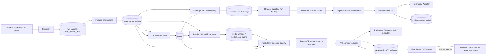

# Poly-Trader As-Is 架構深描

> 本文描述 2026-08-11 所見 committed baseline，並另外標示 dirty WIP/runtime 觀察。它不是理想化架構。

## 1. Executive diagnosis

Poly-Trader 已經有完整的 research→paper/shadow→execution safety 零件，但它不是以清楚 bounded contexts 組成，而是由少數 composition roots 將資料、模型、治理、artifact、API copy 與 UI projection 疊在一起。

量化快照：

| 指標 | 觀測值 |
|---|---:|
| tracked files | 638 |
| Python files | 492 |
| TypeScript/TSX | 35 |
| pytest test functions | 1159 |
| production internal modules | 79 |
| production internal import edges | 119 |
| import SCC/cycles | 0 |
| `server/routes/api.py` internal dependencies | 25 |
| API endpoints in `api.py` | 37 |
| Python lines（排除 env/generated/data） | 約 187k |
| frontend lines | 約 19k |

沒有 production import cycle；主要問題是**責任集中與狀態重複投影**，不是 package 名稱本身。

## 2. Context map

虛線是最危險的 feedback loop：heartbeat 由 artifact 生成 current-state Markdown；AI 下輪又被要求先讀 Markdown，再決定要跑哪些 artifact/probe。若 freshness 或語義世代錯位，敘事會自我強化。

## 3. Bounded contexts（現況）

| Context | 現行 owner/files | 輸入 | 持久化/輸出 | 邊界問題 |
|---|---|---|---|---|
| Ingestion | `data_ingestion/collector.py`, source adapters | public/private APIs | raw DB、runtime status | collector 依賴多 source，source 缺失與中性值容易混淆 |
| Feature Engineering | `feature_engine/preprocessor.py`, `server/senses.py` | raw DB、另行抓取的 4H OHLCV | `features_normalized` | 4H fetch hard-code BTC/USDT；歷史 backfill 重用目前最新 4H snapshot；error/default/None 語義不一致；feature version 未成為 training filter |
| Labeling | `data_ingestion/labeling.py` | feature timestamps、raw prices | `labels` | 固定 20/30/50、-2/-5、24h target；label definition 沒有 version，重算會覆寫同列 |
| Training | `model/train.py` | all feature rows、1440m labels | `xgb_model.pkl`, metrics | timestamp-nearest merge 未 by-symbol；未鎖 feature/label version；缺值填 0/median |
| Model Evaluation | `backtesting/model_leaderboard.py`, API leaderboard helpers | joined frame、model candidates | cache/history/Top-K artifacts | request-time refresh、disk cache、background refresh、live overlay 多層真相 |
| Strategy Research | `backtesting/strategy_lab.py`, API strategy helpers | strategy params、market/features/labels | `~/.hermes/poly-trader/strategies/*.json` | repo 外 persistence；rule/model/backtest/runtime definitions 不完全同一 schema |
| Live Decision | `model/predictor.py` | DB、model files、q15/q35/drift artifacts | confidence payload | signal、support、DQ、patch、breaker、release 疊於單一巨大 payload |
| Personal Release | `model/personal_release.py` | config selector、OOS row、runtime context | overlay fields | policy 與 runtime binding 混合；binding proof 只檢查 boolean+model/profile |
| Bundle Binding | `execution/strategy_bundle.py`, `execution/live_runner.py` | saved strategy、fitted model | immutable bundle/model artifact | exact artifact proof 與 personal-release binding 是兩套未整合機制 |
| Run Control | `execution/control_plane.py` | API cards、saved strategy | raw-SQL `execution_*` tables | 自建 schema 與 SQLAlchemy models 並存；control state 不等於 worker liveness |
| Runtime Worker | `execution/live_runner.py`, shadow daemon | bundle、latest DB row | decisions/JSONL/events | duplicate check 非 atomic unique constraint；沒有顯式 stale-quote max-age；不傳 live permit |
| Order Safety | `execution/execution_service.py` | OrderRequest、config、permit、adapter | trades/lifecycle/permit consumption | 真正安全邊界完整，但 allowlist 空值語義有缺口，且 upstream readiness 未收斂為 typed authorization |
| Venue | `execution/exchanges/*` | config/env/CCXT | order result/account/market rules | metadata artifact 與真實 adapter capability 是不同 truth；WIP 尚未 release-stable |
| API Projection | `server/routes/api.py`, `console_overview.py` | 幾乎所有 contexts | 37 endpoints | 9k+ 行 composition root，同 request 內有 fallback/recompute/background refresh |
| UI Projection | Dashboard/StrategyLab/Execution pages | API projections | user decision surface | 5+ surfaces 重複 humanize 同一 gate；copy 測試多，但權威決策不在 UI |
| Heartbeat/Governance | `scripts/hb_parallel_runner.py`, PM scripts | DB/artifacts/API/docs | JSON、Markdown、issues | 單函式數千行；觀測、修復、重建、文件覆寫與 issue 管理混在同 run |

## 4. End-to-end data flow（現況）

### 4.1 Raw → feature

1. Collector 把多來源資料寫入 `RawMarketData`/`RawEvent`。
2. Preprocessor 由 raw close/volume 計算 1m senses、技術指標、turning-point proxies。
3. Preprocessor 可直接再向 OKX 抓 4H OHLCV；此路徑不是由 raw DB 的同一 snapshot 驅動。
4. `backfill_missing_feature_rows()` 在 loop 前只 fetch 一次目前最新 4H OHLCV，然後對每個歷史缺口重用；4H helper又固定取 indicator array最後一值。因此歷史 row `T` 可能包含 `T` 之後的4H資訊，形成 point-in-time look-ahead。
5. 正常 training 的 sparse 4H rows 以 backward `merge_asof`、6h tolerance 對齊 dense rows；這項正確對齊不會修復已被 backfill 寫入 row 內的未來資訊。
6. 部分 missing sources 保持 `None`，部分 error path 寫中性 0/0.5；資料品質語義不一致。

### 4.2 Feature → label

1. 每個 feature timestamp 尋找當前價格（±10m）與 24h 價格（±60m）。
2. 產生 path-aware spot-long label 與固定金字塔模擬 target。
3. 金字塔 target 固定 20%→30%→50%、第二層 -2%、第三層 -5%、TP 2%、max DD 5%。
4. `save_labels_to_db()` 以 timestamp+symbol+horizon 邏輯更新，但 schema 沒有 `label_definition_version`。
5. 因此策略參數改變不會自然產生新 target lineage；`force_update_all` 會改寫舊 row 語義。

### 4.3 Train/evaluate

1. Training 讀取全部 feature rows 與 target 非空的 1440m labels。
2. feature/label 以 timestamp-nearest ±10m 合併，現行程式未以 symbol partition。
3. sparse 4H backward as-of，其他 missing 值多填 0，4H leading gap 填 median。
4. 產生 lag 12/48/288 與 feature profile；walk-forward 評估輸出 OOS metrics。
5. Leaderboard 另有 memory cache、disk cache、DB history、background refresh 與 request-time live overlay。

### 4.4 Research → saved strategy → bundle

1. Strategy Lab 執行 rule/model backtest，輸出 ROI、drawdown、PF、trades、decision profile。
2. user-saved strategies 寫到 `~/.hermes/poly-trader/strategies/*.json`；system-generated rows immutable。
3. Run control 由 saved strategy 或 synthetic Top-K shadow candidate 產生 strategy binding。
4. `strategy_bundle.py` 可凍結策略參數、schema/model checksum、execution policy。
5. `live_runner.py` 另有 exact fitted artifact/retrain fallback 邏輯；兩條 binding path 尚未成為同一 domain service。

### 4.5 Predict → authorize → execute

1. Predictor 從 DB 讀 latest features，計算 regime gate、structure bucket、entry quality。
2. Predictor再從歷史 labels 計算 decision-quality/support，讀 q15/q35/drift artifacts 做 override。
3. Circuit breaker 可先行把 signal 改為 `CIRCUIT_BREAKER`。
4. Personal release overlay 可保留 owner release，但 technical blocker 令 `allowed_layers=0`。
5. API 把 payload 再投影成 runtime closure、sleeves、readiness、copy。
6. `/api/trade` 對 buy 先讀 current-live projection；通過後呼叫 `ExecutionService`。
7. `ExecutionService` 才是最後 order boundary：live triple config、kill switch、daily loss/failure halt、canary、signed single-use permit、venue normalization。
8. 現行 manual API 與 live runner 都不傳 execution permit，因此 non-dry live order 沒有完整成功旅程。

## 5. God modules 與 seam

### `scripts/hb_parallel_runner.py`

- 11k+ 行；`run_rounds()` 約 3.8k 行。
- 同時負責 process orchestration、timeouts/cache、artifact parsing、gate overlay、issue mutation、Markdown generation、secret redaction。
- 建議 seam：`Scheduler`、`ArtifactRegistry`、`FreshnessPolicy`、`GateProjection`、`CurrentStatePublisher`、`IssueSync`。

### `server/routes/api.py`

- 9k+ 行、37 endpoints、25 internal dependencies。
- 同時做 domain computation、background refresh、cache arbitration、DB query、projection、人類文案。
- 建議 seam：薄 router + application query services + typed DTO mappers；不在 router 重算 policy。

### `model/predictor.py`

- 4.8k 行；live feature load、model fallback、market signal、DQ calibration、support、runtime patch、breaker、release overlay 同檔。
- 建議 seam：`FeatureSnapshotLoader`、`SignalModel`、`MarketRegimePolicy`、`EvidencePolicy`、`RiskCapacityPolicy`。

### `execution/control_plane.py`

- 3.4k 行；profile/run CRUD、strategy selection、bundle freeze、worker poll、outcome reconciliation、readiness projection。
- 建議 seam：run repository、bundle service、worker lease、shadow outcome service、read model projector。

## 6. Truth stores（現況）

| Store | 內容 | 問題 |
|---|---|---|
| `config.yaml` + env | execution/personal release/venue | static intent 與 secret override；不是 runtime proof |
| canonical SQLite | raw/features/labels/trades/events/runs | 最接近事實，但 schema version/provenance 不完整，control plane 又以 raw SQL 自建表 |
| `~/.hermes/.../strategies` | user/system saved strategy JSON | repo 外、沒有 migration/transaction boundary |
| model/live bundle files | fitted model/checksum/metadata | 多套 artifact root 與 fallback |
| `data/*.json` | probes/audits/leaderboards/reconciliation | 198 類 artifact literals、不同 TTL/identity；不是同一 transaction |
| process globals | failure count、refresh state、runtime status | restart 後消失，不應被 persisted docs 當持久 truth |
| API response | request-time aggregate | 目前最接近 user-visible truth，但會 fallback/recompute/queue refresh；不是 immutable snapshot |
| Markdown current-state | operator/AI narration | 由 artifacts 覆寫，可能 stale，且被下輪 AI 當輸入形成 feedback loop |

## 7. Structural risks

1. **Historical look-ahead contamination**：feature backfill把現在最新4H snapshot套到歷史缺口；這是先於模組拆分的P0資料正確性問題。
2. **Identity mismatch**：研究候選、owner selector、predictor runtime model、saved strategy、bundle、shadow runner 可是不同模型。
3. **Versionless data semantics**：feature/label definition 變更後仍共用 rows，training 未鎖 version。
4. **Symbol leakage risk**：training timestamp-nearest merge 沒有 by-symbol partition。
5. **Missingness pollution**：None、0、0.5、median 各自代表 outage/neutral/imputation，卻沒有 missingness mask/provenance。
6. **Gate projection multiplication**：同一 support/readiness 在 predictor、personal release、Top-K、API、heartbeat、PM docs 再算。
7. **No successful live journey**：order boundary 要 permit，但 manual route/runner 未提供；目前 live 是 fail-closed skeleton。
8. **Non-atomic duplicate protection**：先查 count 再 insert，缺資料庫 unique/idempotency invariant。
9. **No explicit quote-age gate in live runner**：collect failure會 HOLD，但讀 latest row 時未看到 max-age contract。
10. **Current docs feedback loop**：generated narrative 可影響下次 agent action，形成 framework capture。
11. **Performance as correctness**：大型 aggregate 若逾 probe timeout，UI 會把「未知」誤作「blocked」或觸發 stale fallback。

## 8. Refactor principle

不採 big bang。先建立 immutable `DecisionSnapshot` 與 typed gate results，讓舊 predictor/API/heartbeat 以 adapter 方式讀同一 snapshot；待 parity BDD 通過後逐步刪除重複投影。ExecutionService 的 hard safety boundary 最後才動，而且先用 characterization tests 鎖死。
